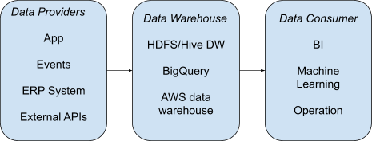
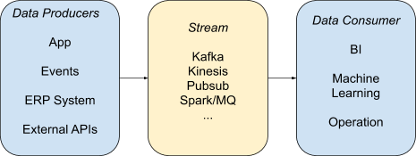
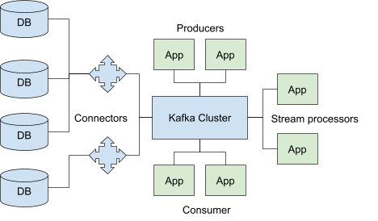
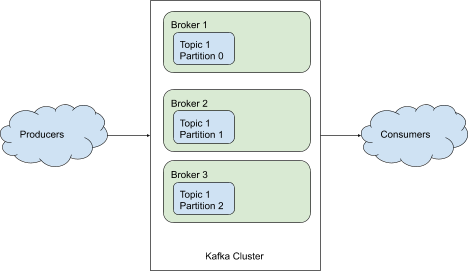
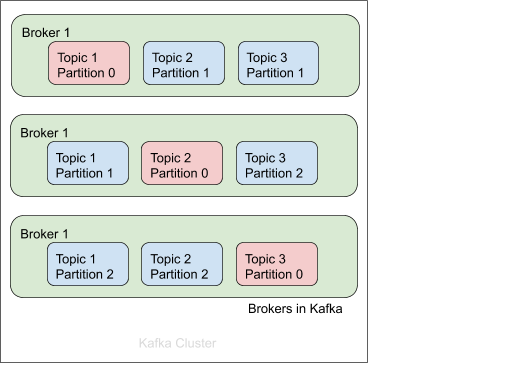
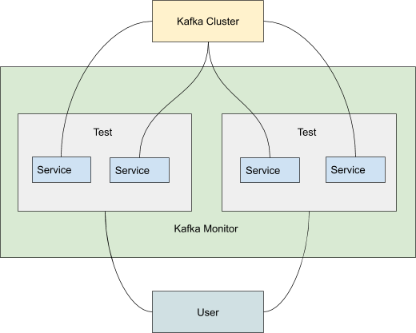

# Intro

## Why Kafka

In batch processing, the ETL processes looks like:

In a data streaming world, the equivalent processes looks like:

However, data streaming is actually more involved than this if we’re taking the full advantage of this system. In the kafka world the consumer can also be configured as upstream, which means a consumer in kafka can also become a producer to trigger other processes.

Main components in Kafka:

- Producers
- Consumers
- Connectors
- Stream processors

In the Kafka world, we can use streaming instead of this ETL batch process. The way streaming works is that all of your data from your data providers or what we'll call producers in Kafka, comes into your streaming platform. In the Kafka world, we can think of our data providers as producers, the things that write data to our cluster. They are sending data in and on the other side, where we have the use cases, we have our consumers. These consumers can also then rewrite data to another part of Kafka so the consumers can become producers.

*Side note:*

*there’s a lot of hype saying “ETL is dead, long live streams.” Well, Airflow says hi.*

## Use case

Kafka has become practically the default for streaming analytics, especially for high-tech companies or companies dealing with large volumes of data. Walmart, the biggest retailer in the United States, possibly the world, has billions of transactions every single day. Netflix, of course, are a high tech company that used data to the fullest extent, uses Kafka pretty heavily. Kafka is a real-time streaming system used by companies such as Spotify, Uber, LinkedIn and Netflix. The system is based on the Apache project Kafka, which is a top level Apache project. It's an open source project that has a large community behind it. We'll take a look at some of the innovations that LinkedIn has offered to the Kafka community.

Kafka is a loosely coupled system, and is a really popular architecture with micro services when you're building large-scale platforms. It's a good way to transfer data between systems, that doesn't tie them directly to each other. For companies that are operating in a more traditional sense like a manufacturing facility, you can use Kafka to monitor all the machines in your plant.

Kafka is an engine that processes data in real-time, rather than batching it over. Instead of taking chunks of data every night or every day, Kafka processes events as they occur. This means that if a company has a problem with a transaction, it may not be caught until the job is done, and that could be dangerous.

## Log

A log is something you can think of as a never ending stream of these changes to a specific category or entity. When a customer were to create their profile on your website, that right there is a change. If the customer calls in and they're trying to verify the address with the sales person, maybe they found out that they typed it incorrectly. This can create all kinds of problems and imagine if you have lots of different systems. If you're using Kafka, this is where the log becomes really handy because the log, it becomes the true source of this information.

## Efficiency

Kafka is an open source system for synchronizing data between systems. It allows for a central repository for all the different entities and streams of data in your enterprise. No longer do you have to decide where the source of truth is between certain apps. You can just write directly to Kafka, and Kafka's built in nature is that it does this write operation very quickly. This also provides great historical tracking, so if you want to know who made what change and when that change was made. The log is also a great way to bootstrap new applications. Kafka is an open source, cloud-based data management system that allows teams to communicate via email. The system was developed by Microsoft to make it easier for teams to share data among their systems. But it's not a magic bullet, and organizations will need to re-tool their systems to work with Kafka.

# Architecture

Architecture of Kafka: A look at the architecture of the data-driven Kafka cluster. Kafka is a distributed database that stores data in the form of logs. The logs are read by consumers and consumers are apps that use the data. A broker is a logical separation of tasks, and you can think of it where a broker could be on a different machine perhaps, so it distributes the load and provides multiple backups of your data. Each broker handles one or more Kafka topics. A Kafka topic is basically that category of changes that I've been talking about.

## Topics and Brokers

#### Topic

- Category/feed
- partitioned

A topic is a category of something or a feed of changes. Each one is a separate log in Kafka and these topics are partitioned across multiple brokers. If one broker goes down or one hard disk fails, the topic can still be read.

#### Broker

- Logical
- Many topics
- resiliency

A broker is a logical separation of partitions of topics, it's just containers or buckets. They handle many topics and they give you that resiliency. When one of these goes down, the system continues to operate and it just automatically shuffles where the operations are occurring.

## Producers

Producers are the things that generate the data and send it to your cluster. When they publish this data, they use something called a partitioner. The partitioner's job is to figure out which partition for the topic that the producer is writing to is the current lead. The durability is a key thing to think about, and so is the ordering and retries.Kafka is an open source project that allows you to write messages to a Kafka console. It's a distributed, peer-to-peer system that lets you write messages in real-time. The Producer API lets you send messages directly into a terminal window, and in doing so, you're sending them to that Kafka topic. In an example, we'll look at batching and compression.

## Consumers

Consumers are organized into consumer groups, and these groups have all the partitions of a topic that they're reading from, divided among all the consumers. Each consumer has their own partition assigned to them, and as consumers come and go, the consumer group needs to be rebalanced. This is handled by Zookeeper and there is a newer version of Kafka which has a Broker coordinator. Autocommit is every five seconds, where it logs essentially where it's at. Each consumer will be reading from a different partition, so they'll have different offsets. This way, if there is some sort of issues with the offset and it needs to switch, it knows where it left off again. In this example, we're passing in three different messages and we're telling it where to read them from, what is the offset. And again, we'll run this here in a minute so you can see it in action.

# Workflow

## Hardware specs

Kafka uses the file system for storing and caching its messages, so you need sufficient memory in order to buffer the active readers and writers. A machine with 64 gigs of RAM is a decent choice, but there are plenty of people using 32 gig machines out there as well. Less than 32 gigabytes of RAM tends to be counterproductive, meaning you need to have a lot of little machines. One recommendation for different Kafka instances is to use multiple log directories, with each directory mounted on a separate drive. **A good medium sized machine and a decent amount of nodes in your cluster is going to give you the best results overall.**

## Typical operational tasks

There's a script that comes with Kafka that you can use when you're executing them from the terminal. You specify where Zookeeper is running and you specify create and topic, then you give it a topic name. The next thing is the number of partitions. Then the replication factor, so how many times do you want this to be replicated? And finally, you add any config values that you need to add in addition to these. If you wanted to delete a topic, this is disabled by default, so you'll actually have to set this to enabled on your Kafka cluster before you can do that. You'll often want to check the position of a consumer, and that again will let you know exactly where that consumer is at in terms of what data it's read from the topic. Lastly, you may need to configure the consumer groups, and this is when you're setting them up.

## Monitor in Kafka

[https://github.com/linkedin/kafka-monitor](https://www.google.com/url?q=https://github.com/linkedin/kafka-monitor&sa=D&ust=1598844604365000&usg=AOvVaw3UX5XGwCXusmoX8OY2gxDb)

Kafka Monitor is an open-source component that you can use to run these long-running tests, and monitor your Kafka Cluster. It gives you the ability to do regression analysis and see how the performance is being affected in other parts of the system. Kafka Monitor is a great way to do continuous deployment, where when you run your tests, you can also be deploying the new code if the tests are successful. Another interesting component of the Kafka Monitor is its ability to test across data centers. It's not that common that you have Kafka running active across multiple data centers, because latency and throughput are the names of the game(kafka).

## Audit in Kafka

Audit in Kafka. There are three types of auditing that I'll talk about here, but there are lots more options that you can explore. One of the other options is from Uber, who uses Kafka extensively for a lot of their applications and their data. Uber open-sourced a service called Uber Chaperone that monitors the timestamps of when things occur. Confluent is an open-source version of Kafka with some commercial components. Jay Kreps, who was the guy at LinkedIn that originally created Kafka, founded Confluent.

[https://github.com/uber-archive/chaperone](https://www.google.com/url?q=https://github.com/uber-archive/chaperone&sa=D&ust=1598844604368000&usg=AOvVaw3myBpNGM5jJp_On7v-qcyk)

[https://www.confluent.io/](https://www.google.com/url?q=https://www.confluent.io/&sa=D&ust=1598844604369000&usg=AOvVaw1gDJz-9ZMw28LYADQhKmbk)